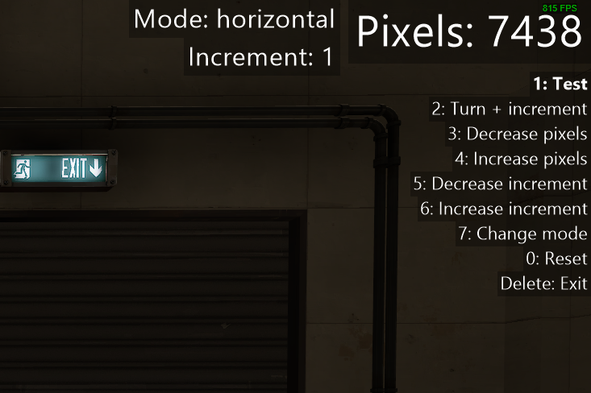

# About
Simple AutoHotKey V2 script to measure sensitivities between games. 

Run DPI.ahk to use. You may need to run this with administrator permissions to get this to work in some games, such as Team Fortress 2. 

# Images

# Credits
Rendering: https://github.com/iseahound/TextRender